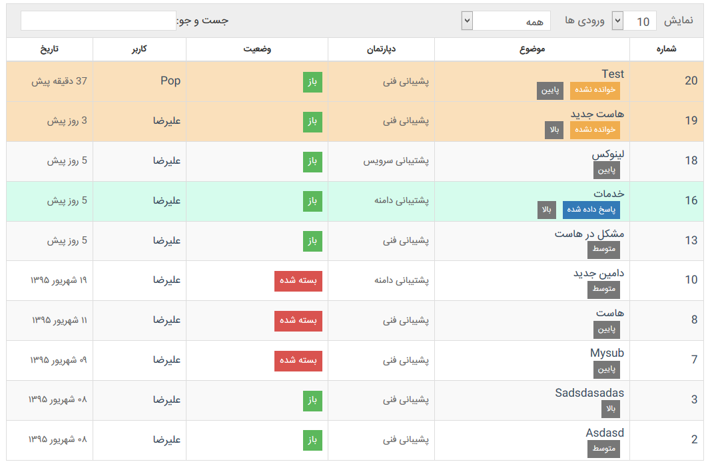
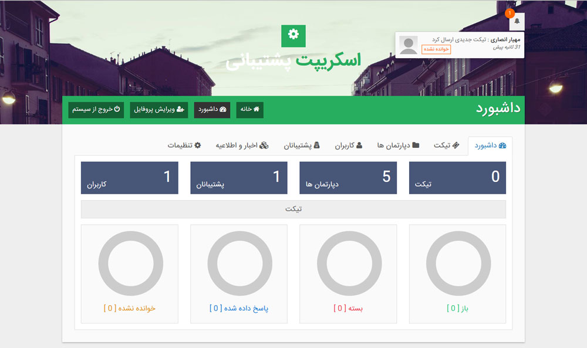
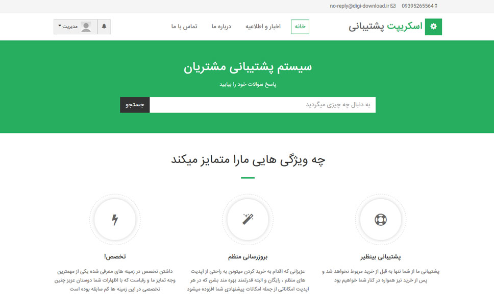
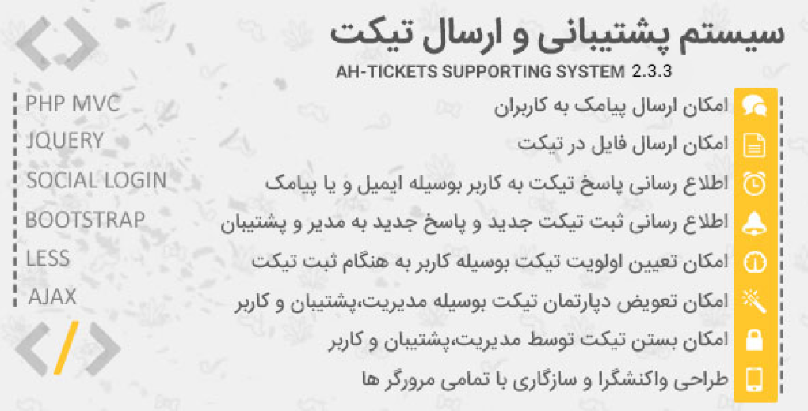

# Professional Support and Ticketing Script

## Version 2.3

### Introduction
This script is a professional support and ticketing system designed to help manage customer support efficiently. All rights reserved for Rastchin and Mahyar Ansari.

### Features
- Comprehensive ticketing system
- Multi-language support
- Email and SMS notifications
- Secure and robust codebase
- Easy installation and update process

### Requirements
- **PHP Version**: 7.4 or higher
- **Web Server**: Apache or Nginx
- **Database**: MySQL 5.7 or higher

### Installation
1. **Download the Script**: Ensure you have the latest version of the script.
2. **Upload to Server**: Upload the script files to your web server.
3. **Database Setup**: Import the provided SQL files (`db.sql` and `db-update.sql`) into your database.
4. **Configuration**: Edit the `config.php` file with your database credentials and other settings.
5. **Run the Setup**: Access `setup.php` in your browser to complete the installation.

### SMS Integration
To use the SMS features, follow these steps:
1. **Register on MeliPayamak**: Visit the [MeliPayamak website](https://www.melipayamak.com) and register.
2. **Purchase a Dedicated Line**: Complete the registration and purchase a dedicated SMS line.
3. **Configure the Script**: Enter your MeliPayamak credentials and dedicated line number in the script's SMS settings.
4. **Activate SMS Notifications**: Enable SMS notifications in the script settings.

### Usage
- **Admin Panel**: Manage tickets, users, and settings from the admin panel.
- **User Panel**: Users can create and manage their tickets.
- **Notifications**: Configure email and SMS notifications for ticket updates.

### Fonts and Licensing
- The fonts used in this script are legally purchased and licensed under code TY3WT.
- Please respect the font licensing terms.

### Updates
- No automatic notifications for updates. Register your email on the provided system to receive update notifications.

### Support
- For any issues or support, refer to the provided video tutorials on Aparat.
- Additional support can be requested via the support system.

### License
All rights reserved for Rastchin and Mahyar Ansari. Unauthorized distribution or modification of this script is prohibited.

### Acknowledgements
Thank you for purchasing this script. We appreciate your adherence to the licensing terms and your support for the developers.

### Screenshots
Here are some screenshots of the script in action:

---

**Note**: This script includes various third-party libraries and assets. Please refer to their respective licenses for more information.
## 📞 Contact Me

    <a href="https://www.linkedin.com/in/hesam-ahmadpour" style="color: red; font-size: 20px; text-decoration: none;">LinkedIn</a> |
    <a href="https://t.me/morpheusadam" style="color: red; font-size: 20px; text-decoration: none;">Telegram</a>

