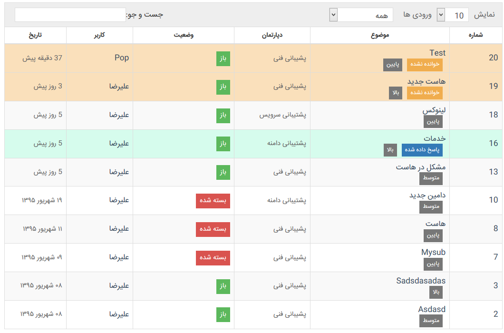
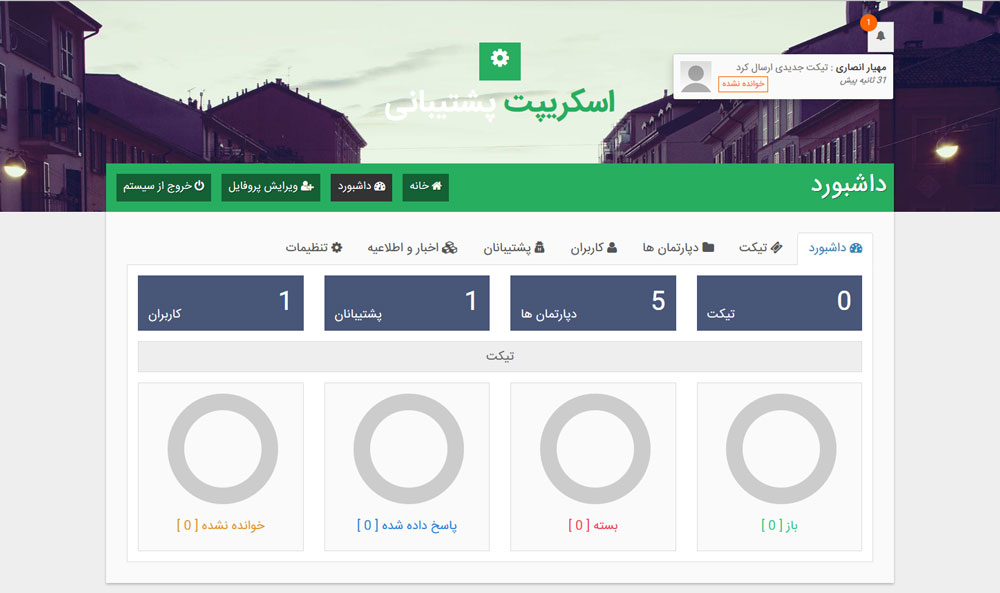
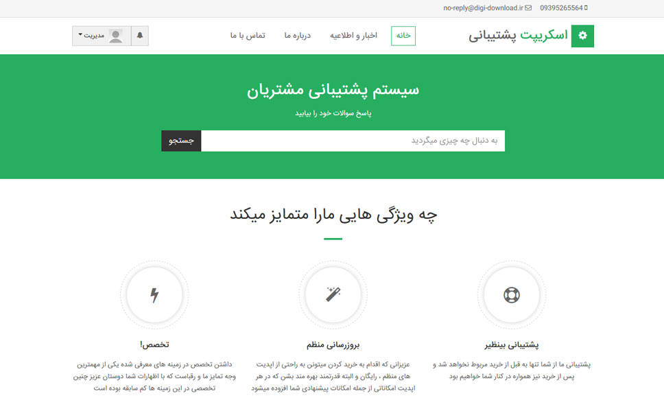
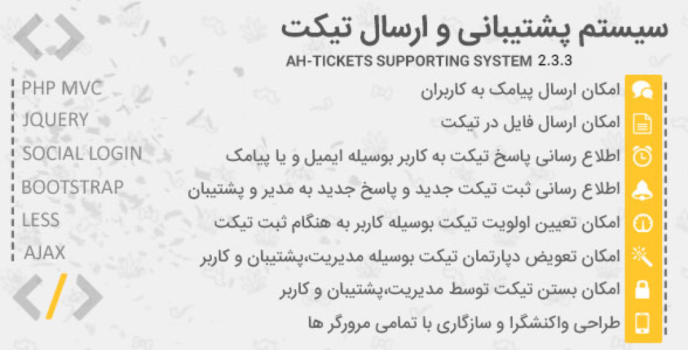

# Desk Nest

Desk Nest is a self-hosted PHP support and ticketing system for businesses, SaaS products, agencies, and web hosts that want a help desk running on their own server.

## Overview

Customers open and follow up on tickets from a user panel, while staff manage departments, knowledge-base articles, users, and settings from an admin panel. Email and SMS notifications keep both sides informed of ticket updates.

The script is written in PHP on an MVC structure — controllers, models, and views with a themeable `AH-Tickets` front end — and stores data in MySQL. It is multi-language and RTL-ready, shipping translation files for English, Persian, Arabic, German, Spanish, French, Italian, Dutch, Russian, Turkish, and others. The current version is 2.3.

## Features

- Ticketing: create, assign, reply to, filter, and track support tickets through their lifecycle.
- Departments and roles, with separate admin, staff, and user dashboards.
- Knowledge base articles so customers can answer common questions themselves.
- Twelve or more bundled language packs (EN, FA, AR, DE, ES, FR, IT, NL, RU, TR and others) with RTL support.
- Email notifications through PHPMailer over SMTP, plus MailChimp integration.
- SMS notifications through the MeliPayamak gateway.
- Accounts: registration, login, account activation, password reset, and social login.
- TinyMCE rich-text editor for ticket and knowledge-base content.
- Bootstrap-based `AH-Tickets` theme with custom fonts and animations.
- Browser-based installer (`setup.php`) and SQL update scripts.

## Requirements

- PHP 7.4 or higher.
- Apache or Nginx.
- MySQL 5.7 or higher.

## Installation

1. Upload the script files to your web server, under the web root.
2. Create a database and import the provided SQL files: `controller/setup/db.sql` and `db-update.sql`.
3. Set your database credentials and other settings in `config.php`.
4. Open `setup.php` in a browser and complete the guided setup.

### Enabling SMS notifications

1. Register at [MeliPayamak](https://www.melipayamak.com) and buy a dedicated SMS line.
2. Enter your MeliPayamak credentials and dedicated line number in the SMS settings.
3. Activate SMS notifications in the settings panel.

## Tech stack

| Layer | Technology |
| --- | --- |
| Backend | PHP 7.4+, MVC (controllers / models / views) |
| Database | MySQL 5.7+ |
| Email | PHPMailer over SMTP, MailChimp |
| SMS | MeliPayamak gateway |
| Frontend | Bootstrap, jQuery with Ajax, TinyMCE, Font Awesome |
| i18n | JSON language packs, RTL-ready, IRANSans web fonts |

## Screenshots

| | |
| --- | --- |
|  |  |
|  |  |

## Project structure

```text
DeskNest/
├── index.php             # front controller / entry point
├── ajax.php              # Ajax request handler
├── config.php            # database and app configuration
├── controller/           # controllers, PHPMailer, MailChimp, setup and installer
│   └── setup/            #   db.sql, db-update.sql, web installer (setup.php)
├── models/               # data models (tickets, users, knowledge, options) and SQL
├── views/                # views and the themeable AH-Tickets theme
├── languages/            # 12+ JSON language packs (EN, FA, AR, DE, ...)
└── public/               # public assets and screenshots
```

## Contributing

Issues and suggestions are welcome via the [issue tracker](https://github.com/morpheusadam/DeskNest/issues). Read the licensing terms below before redistributing or modifying the script.

## Licence and rights

All rights reserved for Rastchin and Mahyar Ansari. Unauthorised distribution or modification of this script is prohibited. The bundled fonts are legally purchased and licensed under licence code TY3WT; respect the font licensing terms. The project also includes third-party libraries and assets such as PHPMailer, Bootstrap, and TinyMCE, each under its own licence.

## Author

Morpheus Adam — web developer, PHP / Laravel / Go.

- GitHub: [morpheusadam](https://github.com/morpheusadam)
- Website: [sam.zeonic.me](https://sam.zeonic.me)
- Email: morpheusadam95@gmail.com
